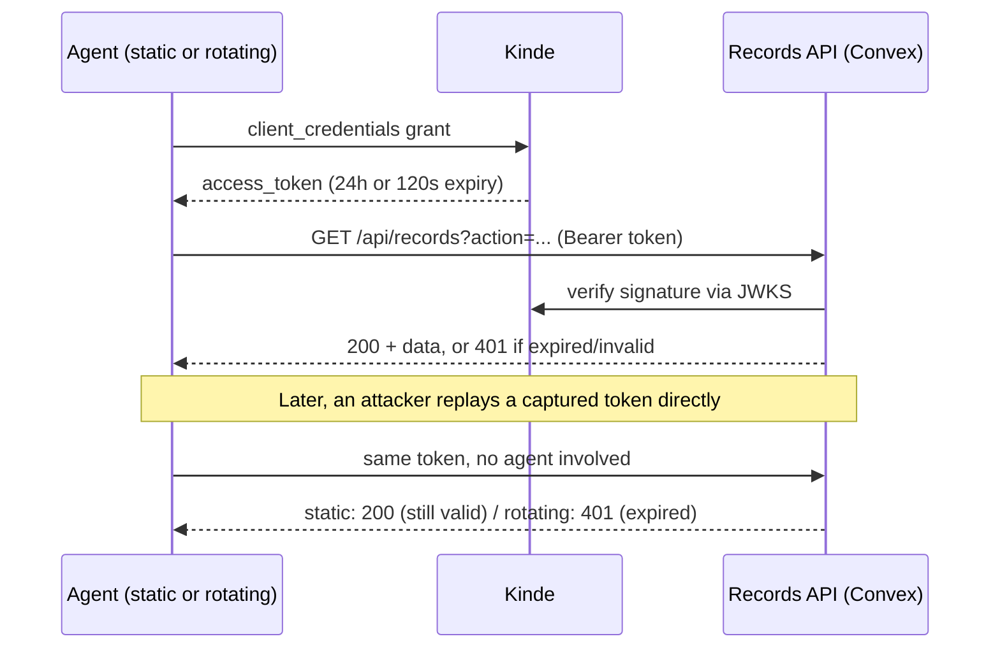

# Rotating Credentials Demo

Two AI agents, same task, same API. One agent mints a Kinde M2M access token
once and holds it for its whole life. The other treats its token as
disposable: it re-mints before a short window closes and never lets one sit
around long enough to matter. Then a captured copy of each token gets
replayed straight against the API, no agent code involved, to see which one
still works.

## Why this exists

Most agent processes fetch a machine-to-machine credential once at startup
and keep using it until something breaks. If that token ever leaks - a log
line, a support ticket, a copied env var - it stays valid for however long
its issuer configured, which for most OAuth client-credentials setups is
somewhere between one hour and one day. An agent that's built to rotate its
credential on a short timer turns that same leak into a non-event: by the
time anyone could do anything with the stolen value, it's already dead.

This repo builds both versions against a Kinde tenant and a
protected API, then proves the difference with a live replay instead of a
diagram.

## How it works



Both agents are Kinde M2M applications authorized against the same API. The
records API is a single Convex HTTP action that verifies every request's
bearer token against Kinde's JWKS endpoint and checks its own scopes -
nothing about the verification code differs between the two agents. The only
difference is configuration: the static agent's Kinde app has the default
access token expiry (86,400 seconds); the rotating agent's is set to 120
seconds, and its credential manager re-mints before that window
closes instead of waiting to get a 401.

A closed action registry (`lib/actionRegistry.ts`) lists the only three
calls either agent may make - `list_records`, `read_record`,
`export_records` - and the API rejects anything outside it before it even
looks at the token.

## The proof

Both agents minted a token, both got captured at the same
instant, then replayed - unmodified, outside any agent code - after waiting
past the rotating agent's window:

| Agent    | Token expiry | Replay result | Status | Latency |
|----------|---------------|----------------|--------|---------|
| Static   | 24h (default) | still works    | 200    | 1353ms  |
| Rotating | 120s          | dead           | 401    | 938ms   |

The static agent's leaked credential is good for the rest of the day. The
rotating agent's is worthless within minutes of being stolen.

## Setup

Every credential this repo needs, and where it comes from:

1. Kinde API. In your Kinde dashboard: Settings -> APIs -> Add API. Give it
   a name and an audience identifier, for example
   `https://rotating-credentials-demo.api` (it doesn't need to resolve to
   anything real). That identifier is `KINDE_M2M_AUDIENCE`.
2. Two M2M applications. Settings -> Applications -> Add application ->
   Machine to machine, once for the static agent and once for the rotating
   agent. On each app's APIs tab, authorize it against the API from step 1.
   - On the static agent's app: Tokens tab, leave Access token expiry at
     the default (86400).
   - On the rotating agent's app: Tokens tab, set Access token expiry to
     something short - this demo uses 120.
   - Each app's Details tab shows its Client ID and Client Secret. The
     static agent's go into `STATIC_AGENT_CLIENT_ID` /
     `STATIC_AGENT_CLIENT_SECRET`, the rotating agent's into
     `ROTATING_AGENT_CLIENT_ID` / `ROTATING_AGENT_CLIENT_SECRET`.
   - The Details tab also shows Domain - that's `KINDE_DOMAIN`
     (`https://your-subdomain.kinde.com`).
3. Anthropic API key. console.anthropic.com -> API Keys -> Create Key. That
   value is `ANTHROPIC_API_KEY`.
4. Copy `.env.local.example` to `.env.local` and fill in everything from
   steps 1-3.
5. `npm install`
6. `npx convex dev --once`. This creates your own Convex dev deployment and
   writes `CONVEX_DEPLOYMENT`, `NEXT_PUBLIC_CONVEX_URL`, and
   `NEXT_PUBLIC_CONVEX_SITE_URL` into `.env.local` for you - nothing to copy
   by hand for those three. Convex functions don't read `.env.local` though,
   so give the deployment its own copy of the Kinde values:
   ```
   npx convex env set KINDE_ISSUER https://your-subdomain.kinde.com
   npx convex env set KINDE_M2M_AUDIENCE https://your-api-identifier
   npx convex env set STATIC_AGENT_CLIENT_ID <client id>
   npx convex env set ROTATING_AGENT_CLIENT_ID <client id>
   ```
7. `npx convex run records:seed`
8. `npm run agent:static` and `npm run agent:rotating` to sanity-check both
   paths, then `npm run prove:rotation` for the live replay proof.
9. `npm run dev` to watch it happen on the dashboard in real time.

## Limitations

- Kinde documents rotating an M2M client's *secret* as a manual operation,
  not an automated one. This demo rotates the *access token*, which Kinde
  issues fresh on every client-credentials request - that's the layer that
  actually matters for a leaked-token scenario, but it's a different thing
  from secret rotation and the two shouldn't be conflated.
- 120 seconds is a demo-speed number chosen so the proof runs in a couple of
  minutes. A production window would more typically sit in the 5-15 minute
  range, traded off against how often your workload can tolerate a refresh.
- The API's JWT verification doesn't distinguish "expired" from "signed by
  an app we don't recognize" in its response body - both come back as a
  generic 401. Fine for this demo's purposes, not something to copy for a
  production audit trail.
